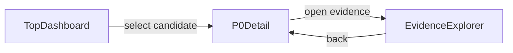

# UI Flow（Week1）

## 対象
- 会議前導線のみ: `Top -> P0 -> Evidence`

## 画面遷移

## 画面ごとの責務

### TopDashboard
- 候補者一覧の比較判断
- 判定/信頼度/リスクを即時把握

### P0Detail
- 1名の評価全体像（可視化 + AI理由）を提示
- 会議開始前の論点を明確化

### EvidenceExplorer
- AI結論の根拠追跡
- 根拠IDと解釈プロセス（explainTrace）の確認

## 導線ルール
- Top -> P0 は1クリック
- P0 -> Evidence は2クリック以内
- どの画面でも「AIは最終決裁しない」を視認可能にする
